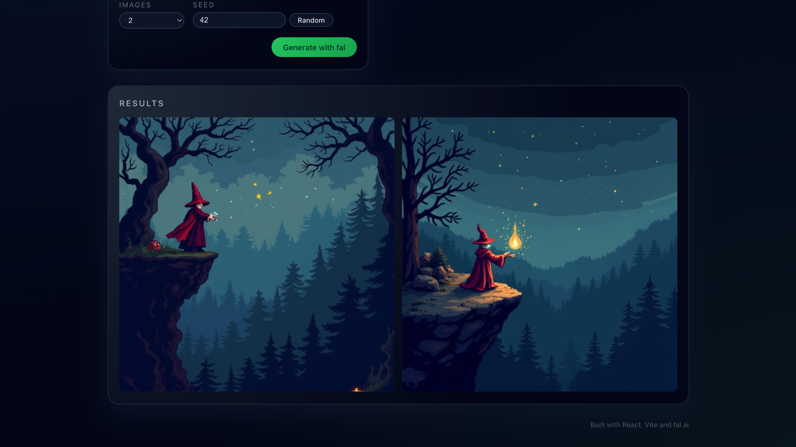

# Prompt Studio — text-to-image with fal.ai

A small React + Vite web app that turns a natural-language description into images using
[fal.ai](https://fal.ai). Built during the **Spark Fellowship by Fab** (Istanbul cohort, Feb 2026).

The user writes a prompt, picks a visual style, sets aspect ratio / variation count / seed, and the
app calls fal.ai to synthesize the images. Everything runs in the browser; generation happens on
fal.ai's infrastructure.



## Features

- **Text-to-image prompting** — free-form prompt textarea.
- **Style presets** — four chips that append style hints to the prompt:
  - `Photoreal` — highly detailed, 35mm photography, natural lighting
  - `Illustration` — vector illustration, clean lines, flat colors, dribbble shot
  - `Anime` — anime style, vibrant colors, cinematic lighting
  - `Pixel Art` — 16-bit pixel art, low resolution, crisp pixels, game sprite
- **Aspect ratio** — 1:1, 4:5, or 16:9.
- **Variations** — generate 1, 2, or 4 images per run.
- **Seed control** — fixed seed for reproducibility, or randomize for variation.
- **Gallery view** — results render in a responsive grid for side-by-side comparison.
- **Queue progress + error states** — `onQueueUpdate` logs are surfaced while a job is running, and
  missing-key / empty-result / request failures each get their own message.

## Model and client

The app uses the [`fal-ai/flux/dev`](https://docs.fal.ai/examples/model-apis/generate-images-from-text)
text-to-image model (FLUX.1 [dev]) through the official `@fal-ai/client` JavaScript client, configured
once at startup:

```js
import { fal } from "@fal-ai/client";

fal.config({ credentials: import.meta.env.VITE_FAL_KEY });
```

Generation is a single `fal.subscribe` call — the client handles queueing and progress updates, so the
frontend only has to build the prompt and render the returned image URLs:

```js
const result = await fal.subscribe("fal-ai/flux/dev", {
  input: {
    prompt: styledPrompt,   // base prompt + selected style suffix
    seed,
    image_size,             // "square" | "portrait_4_5" | "landscape_16_9"
    num_images,             // 1 | 2 | 4
  },
  logs: true,
  onQueueUpdate: (update) => { /* progress */ },
});
```

Image URLs are read from `result.data.images` and rendered into the grid.

## Getting started

```bash
npm install
cp .env.example .env     # then paste your fal.ai key into VITE_FAL_KEY
npm run dev
```

`.env` is gitignored — the key stays local and is never committed.

## Stack

React 19 · Vite 7 · `@fal-ai/client` · ESLint 9

## Scripts

| Command | What it does |
| --- | --- |
| `npm run dev` | Start the Vite dev server with HMR |
| `npm run build` | Production build |
| `npm run preview` | Preview the production build |
| `npm run lint` | Run ESLint |
